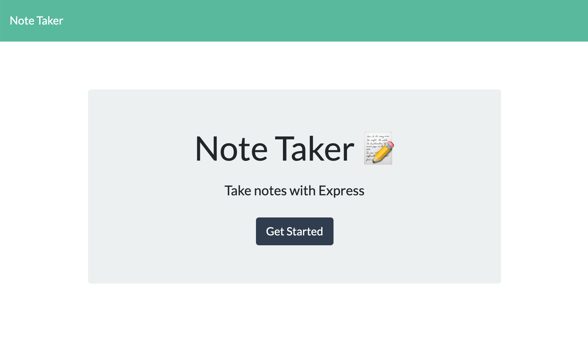
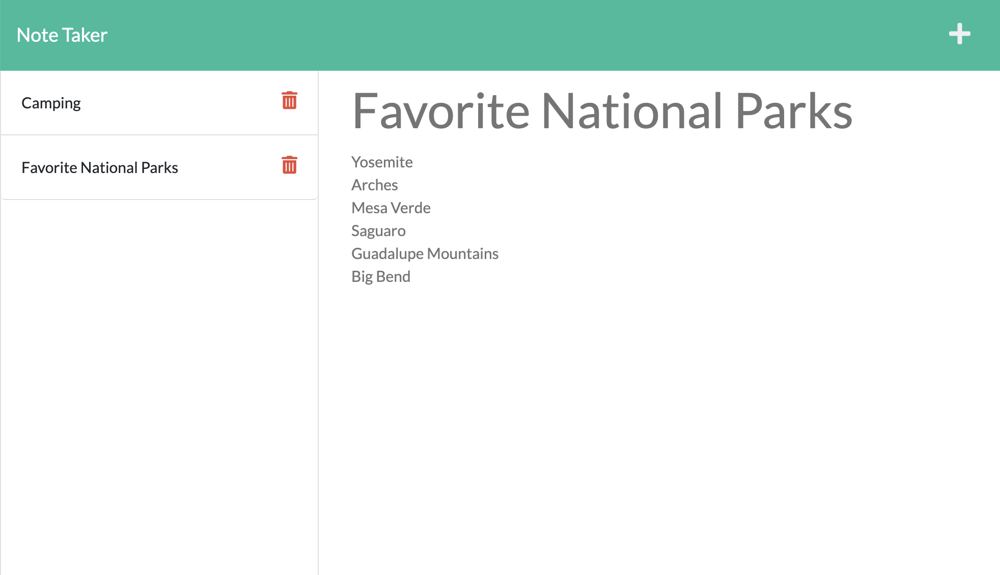

# Note Taker

## Description
This web application allows users to take notes, save them, and delete them as they please. 

Although the front-end had already been created, my challenge was to build the back-end by creating a server, connecting it to the front-end, and deploying the application to Heroku. My biggest obstacle was creating the DELETE api route, which required additional research. In the end, the DELETE api route was created and tested with successful results. 

## Table of Contents

- [Installation](#installation)
- [Usage](#usage)
- [Screenshot](#screenshot)
- [Credits](#credits)
- [License](#license)

## Installation

Installation is not required. Please navigate to the deployed site by [clicking this link](https://calm-mountain-78934.herokuapp.com/). 

## Usage

1. Open the deployed site 
1. Click the `Get Started` button
1. To add new notes
    - Enter your `Note Title` and `Note Text`
    - Click the save icon to save
1. To delete saved notes
    - Click on the red trash icon next to the note you'd like to delete

## Screenshot

## Credits

While creating this project, I read documentation on express.js, and the uniqid npm package. Additionally, I recieved feedback and support from my 2U tutor. 

- [express.js npm package](https://www.npmjs.com/package/express)
- [uniqid npm package](https://www.npmjs.com/package/uniqid)

## License

[MIT](https://spdx.org/licenses/MIT.html)
